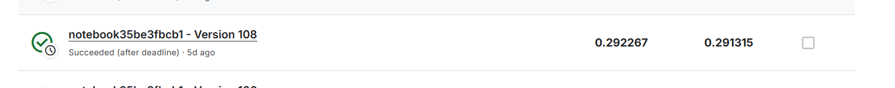

# NYCU Computer Vision 2026 Final Project

- **Student ID:** 112550200
- **Name:** Zheng Wu Qian

## Introduction

This repository contains my final project solution for NYCU Computer Vision
2026. The task is based on **Image Matching Challenge 2024 - Hexathlon**:
estimate camera poses for unordered image collections and submit a valid
`submission.csv` to Kaggle.

The final solution is an IMC-style Structure-from-Motion pipeline with a
transparent-scene special branch:

- LoMa-B local feature matching for normal scenes.
- MAGSAC fundamental-matrix verification with the final RANSAC threshold set
  to `1.08`.
- PyCOLMAP incremental SfM with shared camera intrinsics for images with the
  same resolution.
- Scene-level ALIKED + LightGlue fallback for weak LoMa reconstructions.
- Gated centroid pose recovery for missing images.
- Transparent-scene ring-pose prior using LoMa 20% + ALIKED 80% rank ensemble
  for circular image ordering.

The final submitted version is:

```text
ver141
```

Its best validated Kaggle score is:

```text
0.292267
```

Detailed version-by-version ablation notes are in:

```text
reports/final_version_ablation_report.md
```

## Environment Setup

The Kaggle competition reruns notebooks with internet disabled. Therefore, the
offline dependency bundle must be uploaded as a Kaggle Dataset:

```text
imc2024-final-project-deps.zip
```

The zip is built from the cleaned `kaggle_deps/` directory and contains the
required wheels, source trees, and model checkpoints:

```text
pycolmap
h5py
kornia
kornia-rs
lightglue
kneed
LoMa source and loma_B.pt
dad.pth for the LoMa DaD detector
ALIKED and ALIKED-LightGlue checkpoints
GIM / LightGlue fallback files
DeDoDe diagnostic files
DINOv2 checkpoint
```

On Kaggle, attach both datasets:

```text
image-matching-challenge-2024
imc2024-final-project-deps
```

The notebook automatically locates the dependency dataset under `/kaggle/input`,
installs missing wheels with `--no-index`, and copies model weights into the
local torch cache.

For local development, use a Python environment with:

```text
torch
opencv-python
numpy
pandas
pycolmap
lightglue
kornia
scikit-learn
tqdm
Pillow
```

## Usage

### Kaggle Submission

Upload and run the final notebook:

```text
ver141.ipynb
```

The notebook writes the required submission file:

```text
/kaggle/working/submission.csv
```

When submitting to Kaggle, choose:

```text
Output file: submission.csv
```

Recommended backup notebooks:

```text
tested/ver169.ipynb
tested/ver144.ipynb
tested/ver136.ipynb
tested/ver102.ipynb
```

### Local Script Run

The reusable Python pipeline can also be run locally:

```bash
python src/top_imc_pipeline.py \
  --data_root data \
  --output output/submission.csv \
  --report reports/top_pipeline_report.md \
  --matcher_backend loma \
  --loma_variant B \
  --min_matches 40
```

The Kaggle notebooks are the authoritative submission artifacts because they
embed the exact version-specific configuration and offline dependency setup.

## Performance Snapshot

| Version | Description | Kaggle Score |
| --- | --- | ---: |
| `ver141` | Final version: transparent ordering + RANSAC `1.08` | **`0.292267`** |
| `ver169` | RANSAC `1.075` backup | `0.290150` |
| `ver144` | Low-weight DeDoDe transparent score backup | `0.289834` |
| `ver136` | Transparent resize `2400` + rotation backup | `0.289478` |
| `ver102` | Simpler strong baseline with RANSAC `1.00` | `0.288293` |



## Repository Structure

```text
.
├── src/
│   ├── top_imc_pipeline.py
│   ├── imc2024_pipeline.py
│   └── check_submission.py
├── reports/
│   └── final_version_ablation_report.md
├── kaggle_deps/
├── imc2024-final-project-deps.zip
├── ver141.ipynb
├── leaderboard.png
└── tested/
```
